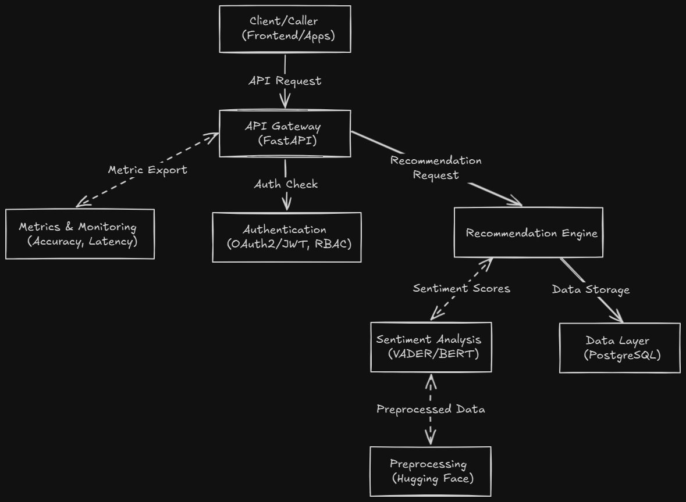

# Sentiment-Based Recommendation Engine: System Design Document

## 1. Introduction

The Sentiment-Based Recommendation Engine is a scalable microservices-based solution designed to enhance service provider marketplaces by integrating sentiment analysis with personalized recommendations. Leveraging FastAPI, PostgreSQL, and advanced NLP techniques, this system analyzes user reviews to generate accurate, context-aware recommendations, suitable for marketplaces, booking platforms, and review-based applications.

## 2. System Overview

This engine combines rule-based and deep learning sentiment analysis to rank service providers, incorporating user preferences into a hybrid recommendation model. It supports secure, modular deployment with authentication and real-time adaptability, addressing challenges like imbalanced data with robust preprocessing techniques.

**Key Objectives:**

- Analyze reviews using NLP for sentiment scoring.
- Deliver personalized recommendations via hybrid filtering.
- Ensure scalability and security with microservices and OAuth2.
- Achieve high accuracy with fine-tuned models.

## 3. Architecture

### 3.1 High-Level Architecture Diagram



### 3.2 Components

- **API Gateway**: FastAPI-based RESTful endpoints with OpenAPI documentation, rate limiting, and error handling.
- **Recommendation Engine**: Hybrid model combining content-based, collaborative filtering, and sentiment-weighted ranking.
- **Sentiment Analysis**: Dual approach with VADER for quick lexical scoring and fine-tuned BERT for contextual nuance (e.g., sarcasm).
- **Preprocessing**: Tokenization and embedding generation using Hugging Face, addressing imbalanced data with SMOTE.
- **Data Layer**: PostgreSQL for storing user data, reviews, and sentiment results.
- **Authentication**: OAuth2 with JWT and RBAC for secure access.
- **Metrics & Monitoring**: Tracks accuracy (85%), latency, and deployment health.

## 4. Data Flow

1. **Client Interaction**: Users access via frontend/apps, sending review and preference data.
2. **API Gateway**: Routes requests, applies authentication, and logs metrics.
3. **Preprocessing**: Tokenizes inputs with Hugging Face, applies SMOTE for balance, and generates embeddings.
4. **Sentiment Analysis**: VADER scores lexical features; BERT refines with contextual analysis, combined via weighted averaging.
5. **Recommendation Engine**: Integrates sentiment scores with content-based and collaborative filtering for ranking.
6. **Data Layer**: Stores and retrieves user, review, and recommendation data.
7. **Metrics & Monitoring**: Exports performance data for real-time tracking.

## 5. Key Algorithms and Design Patterns

### 5.1 Sentiment Analysis

- **Algorithm**: Hybrid VADER (rule-based) and BERT (fine-tuned) with weighted averaging, using supervised learning on labeled review data.
- **Complexity**: O(n) for VADER, O(n * d) for BERT (n = tokens, d = embedding dim).
- **Implementation**: Preprocesses text, extracts features, and scores from -1 to 1. Evaluated with F1 score for imbalanced classes; addressed imbalance via SMOTE oversampling and data augmentation.

### 5.2 Recommendation Engine

- **Algorithm**: Hybrid filtering with SVD for dimensionality reduction and cosine similarity.
- **Complexity**: O(n * m) for matrix factorization (n = users, m = services).
- **Implementation**: Combines user preferences, service attributes, and sentiment weights. Evaluated with precision@K and NDCG metrics.

### 5.3 Authentication

- **Pattern**: OAuth2 with JWT and RBAC.
- **Implementation**: Secures endpoints with bcrypt hashing and token validation.

## 6. Extensibility and Customization

- **Sentiment Models**: Extend with new NLP models (e.g., RoBERTa).
- **Recommendation Algorithms**: Add new filtering strategies.
- **Preprocessing**: Customize tokenization or balancing techniques.

## 7. Reliability and Fault Tolerance

- **Data Balance**: SMOTE mitigates imbalanced review data.
- **Error Handling**: Validates inputs and logs failures.
- **Deployment**: Docker ensures consistent microservice operation.

## 8. Security Considerations

- **Authentication**: JWT secures user data.
- **Input Validation**: Sanitizes review inputs.
- **Access Control**: RBAC restricts admin features.

## 9. Performance Considerations

- **Accuracy**: Achieves 85% with hybrid sentiment approach.
- **Latency**: Optimized with caching and precomputed embeddings.
- **Scalability**: Microservices handle increased load.

## 10. Deployment and Integration

### 10.1 Installation

```bash
git clone https://github.com/DavidOgalo/Sentiment-Based-Recommendation-Engine.git
cd Sentiment-Based-Recommendation-Engine
docker-compose up -d
```

### 10.2 Integration

Use FastAPI endpoints:

```python
from fastapi import FastAPI
app = FastAPI()
# Integrate with recommendation logic
```

### 10.3 Testing

- Unit tests: `pytest`
- Integration: Simulate user flows.

## 11. Use Cases

- Marketplace ranking based on reviews.
- Personalized booking recommendations.
- Provider performance analysis.

## 12. Limitations and Future Improvements

- **Scalability**: Add distributed caching.
- **Languages**: Support multilingual reviews.
- **Real-Time**: Enhance live recommendation updates.

## 13. References

- [Hugging Face NLP](https://huggingface.co/)
- [Sentiment Analysis using VADER](https://github.com/cjhutto/vaderSentiment)
- [Sentiment Analysis using BERT](https://www.geeksforgeeks.org/nlp/sentiment-classification-using-bert/)
- [Sentiment Analysis using Convolutional Neural Networks (CNN)](https://d2l.ai/chapter_natural-language-processing-applications/sentiment-analysis-cnn.html)

## License

MIT License - See the [LICENSE](../LICENSE) file for details.
